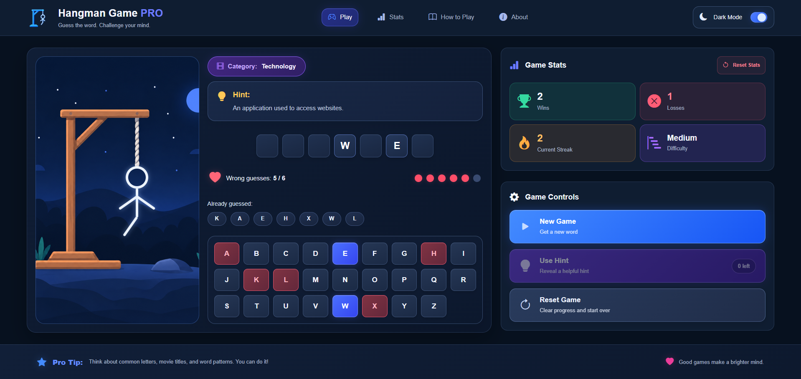

# 🎮 Hangman Game PRO

### A modern, interactive word-guessing game built with Vanilla JavaScript.

Test your vocabulary, guess hidden words, and challenge yourself to win before the hangman is complete.

Built with **HTML5, CSS3, and Vanilla JavaScript**, featuring a responsive interface, multiple word categories, interactive keyboard, game statistics, and persistent data storage.

**[🎮 Live Demo]()** · **[💻 GitHub Profile](https://github.com/JohnYisBackk)** · **[🌐 Portfolio](https://samueljahn.sk)**

---

## 📸 Preview

---

## ✨ Features

- **30 Unique Words** — Four categories: Movies, Animals, Countries, and Technology.
- **Random Word Selection** — Automatically selects a word and prevents the same word from appearing twice in a row.
- **Interactive Keyboard** — Guess letters using an on-screen A–Z keyboard.
- **Dynamic Word Display** — Correctly guessed letters are revealed automatically.
- **Animated Hangman Progress** — The hangman appears progressively after incorrect guesses.
- **Wrong Guess Tracking** — Six incorrect attempts allowed per game.
- **Hint System** — Reveal one clue per game.
- **Win & Loss Detection** — Automatically identifies completed or lost games.
- **Game Statistics** — Tracks wins, losses, and current winning streak.
- **Persistent Statistics** — Saves game results using localStorage.
- **Reset Statistics** — Clear saved statistics with confirmation.
- **New Game & Reset Game** — Start a new random word or restart the current round.
- **Dark & Light Mode** — Switch themes with saved preferences.
- **Responsive Layout** — Designed for desktop, tablet, and mobile devices.

---

## 🛠️ Technologies Used

- **HTML5** — Semantic structure
- **CSS3** — Layout, responsive design, transitions, and themes
- **JavaScript (ES6+)** — Game logic, state management, and DOM manipulation
- **LocalStorage API** — Persistent game statistics and theme preferences
- **Bootstrap Icons** — Interface icons

No JavaScript frameworks or external game engines required.

---

## 🎯 How to Play

1. Start a new game to receive a random hidden word.
2. Check the displayed word category.
3. Click a letter on the virtual keyboard.
4. Correct guesses reveal matching letters.
5. Incorrect guesses progressively reveal the hangman.
6. Use your hint when you need help.
7. Reveal the complete word before reaching six incorrect guesses to win.

**Winning:** Every letter in the word is revealed.

**Losing:** Six incorrect guesses are made.

Your results are automatically saved after each completed game.

---

## 🧠 JavaScript Concepts Practiced

This project focuses on fundamental frontend development concepts:

- DOM selection and manipulation
- Event listeners and user interactions
- JavaScript functions and application state
- Arrays and objects
- Array methods: `forEach()`, `includes()`, and `every()`
- Random number generation using `Math.random()`
- Conditional statements
- `do...while` loops
- Dynamic HTML rendering
- CSS class manipulation
- JSON serialization with `JSON.stringify()` and `JSON.parse()`
- Saving and loading data with `localStorage`
- Organizing reusable functions

---

## 📁 Project Structure

- **index.html** — Application structure and game interface
- **style.css** — Styling, themes, and responsive design
- **script.js** — Game logic and interactivity
- **images/** — Project images and visual assets
- **preview.png** — Project screenshot
- **README.md** — Project documentation
- **LICENSE** — MIT license

---

## 🚀 Run Locally

1. Clone the repository from GitHub.
2. Open the project folder.
3. Open `index.html` in your browser.

Alternatively, run the project using the **Live Server** extension in Visual Studio Code.

No installation, dependencies, or build process required.

---

## 🔮 Future Improvements

- Difficulty selection with different word lengths
- Physical keyboard support
- Additional word categories
- Improved end-game animations
- Custom notification modals
- Sound effects

---

## 👨‍💻 Author

**Samuel Jahn**

Frontend Developer

- **Portfolio:** https://samueljahn.sk
- **GitHub:** https://github.com/JohnYisBackk

---

## 📄 License

This project is licensed under the **MIT License**.

© 2026 Samuel Jahn
